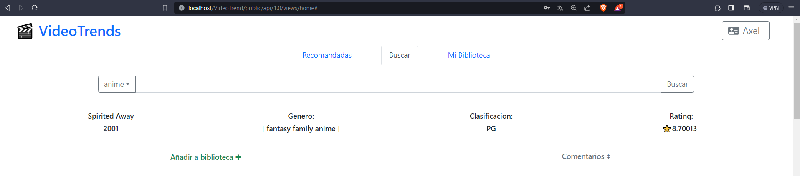

# Proyecto: VideoTrend

**Descripcion :**

Aplicacion web de consultas de peliculas y creacion de biblioteca con sus peliculas de preferencia para ususarios registrados previamente. Permite informarse de las peliculas mas recomendadas como los comentarios con mas puntaje (mas concuerdan los usuarios), su genero, clasificacion, y raitign/puntiacion otorgado a la pelicula.

## Caracterisitcas 

- Registro y auntenticacion de usuarios.
- Validacion y autenticacion de email de registro.
- Actualizacion y control de datos de usuario.
- Alta y baja de peliculas en biblioteca personal.
- Validacion y control de datos de entrada.
- Encriptacion de activos (password).
- Conexion a servicios de terceros (API trakt - SMTP Miltrap)

## Tecnologias Utilizadas
- **PHP y CodeIgnater 4**
- **Composer**
- **Servidor Apache**
- **Base de datos : PostgreSQL** 
- **Boostrap 5**

## Arquitectura: 
- Utilizacion de arquitecutra **MVC**
- Utilizacion de arquitectura **REST** para el manejo de las rutas
 
## Intalacion y configuracion
- Instalar XAMPP (Con php y apache) : https://www.apachefriends.org/es/index.html
- Instalar Composer : https://getcomposer.org/
- Instalar PostgreSQL : https://www.postgresql.org/download/
- En WAMPP en la fila del servicio de apache > boton config > PHP(php.init)
    - Quitar los `;` delante de las siguietes extenciones en el archivo para  habilitarlos: `extension=pgsql`, `extension=pdo_pgsql` y `extension=intl`.
- En la base de datos PostgreSQL crear las tablas e insertar los datos para poder probar segun lo indica el archivo `Instrucciones_DB.sql` del proyecto.
- Posicionarse con git en la carpeta htdocs de XAMPP y lugo clonar proyecto en esa carpeta.
- Clonar proyecto del repositiorio : `git clone https://github.com/AxelK1999/VideoTrends.git`
- Estando posicionado en la carpeta del proyecto previamente clonado, en la terminal:
    1. Instalacion de dependencias: `composer install` de surgir algun problema `composer update`. 
- Crearse una cuante y logearse en https://mailtrap.io/signin y acceder a `Home` > `email testing` > `SMTP Settings` > `Show Credentials` > definir los datos SMTP que se especifican en el clase `app/Helpers/Email.php` > variable `$emailConfig`. Permitira ver los email de validacion de cuenta, de lo contrario al registrar no tendra accesos.

## Uso
- Correr el proyecto : abrir panel de control de XAMPP > iniciar(start) el servicio de apache y acceder a `http://localhost/VideoTrends/public/api/1.0/views/login`.

